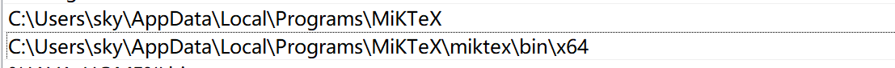

# NESCQR

This repository is the implementation of the paper: A novel wind power interval prediction method based on neural ensemble search and dynamic conformalized quantile regression (<b>NESCQR</b>). 

## Quick start
### 1. Install dependencies 
Install the environment dependencies using the following command:

```bash
conda create -n nescqr
conda activate nescqr
pip install -r requirements.txt
```

### 2. Install latex and add it to the system's PATH variable
To support scienceplots, you need to install LaTeX on your device and add the installation path to the system's PATH variable. 

Here's an example for Windows. It's recommended to install [MikTeX](https://miktex.org/download), and then add the MikTeX installation path to the system's environment variables. An example of system environment variables is shown in the following figure:




### 3. Download and extract data
Create a new folder named `data`, and then download the datasets into the `data` folder. Below are the two wind power datasets used in this study:

[1] [Kaggle: Wind Power Forecasting](https://www.kaggle.com/datasets/theforcecoder/wind-power-forecasting/) 
[2] [Kaggle: Wind Turbine Power (kW) Generation Data](https://www.kaggle.com/datasets/psycon/wind-turbine-energy-kw-generation-data/data)

After downloading, unzip these two datasets.

### 4. Run
Due to the large size of the datasets, it is recommended to use a GPU for running the experiments. 

Run the experiments on the wind power dataset with the following command:
`python main_wind_power.py`

The same as the wind turbine dataset:
`python main_wind_turbine.py`
